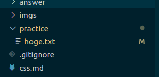
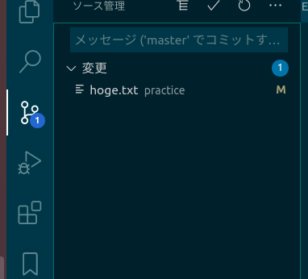
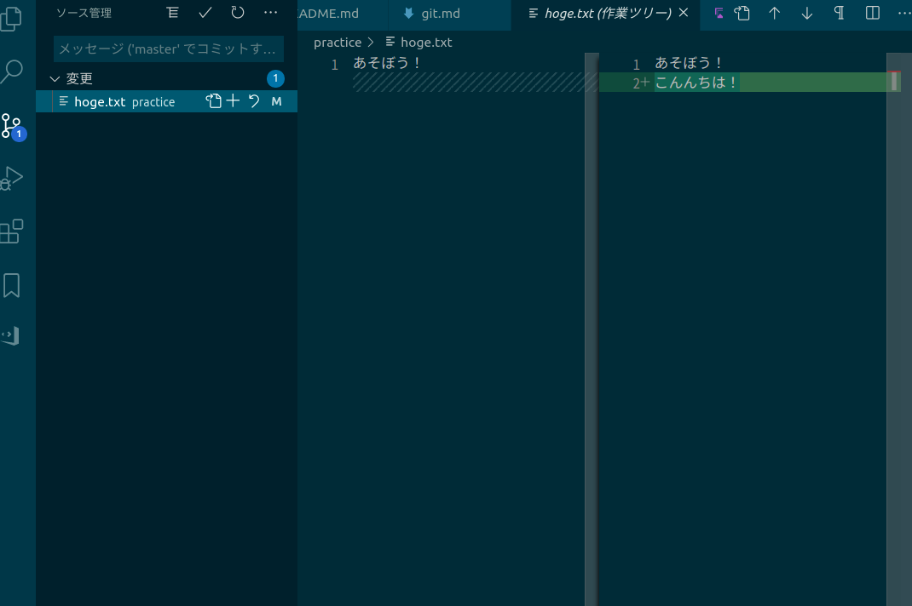
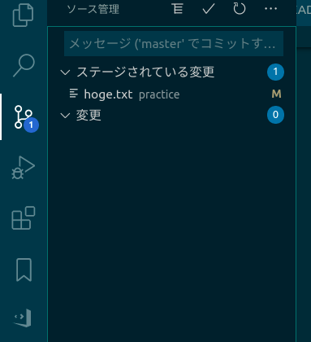
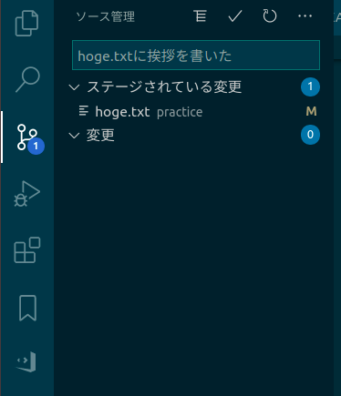

# git編

git は web サイトを作る上では必須ではありません。しかし、web 開発に限らず、共同開発をする上では必須と言っていいほどだと思います。
また、個人開発でも一度使うと手放せなくなります。ぜひ使えるようになりましょう。

ここでは、gitとGitHubをまとめて説明します。
[GitHub](https://github.com)のアカウントを作っておいてください。


## 章末課題

1. [練習用リポジトリ](https://github.com/ebiyuu1121/web-tutorial-practice)をforkしてください。
2. forkしたリポジトリをcloneしましょう。
3. 自分の名前（GitHub id やニックネームで大丈夫です）のフォルダを作りましょう。
4. フォルダの中に適当なテキストファイル（`好きな名前.txt`）を作って、何か書きましょう。
5. ステージ・コミット・push をして、GitHub に反映させましょう。
6. 先ほど作成したファイルを編集してみましょう。
7. 今度はVSCodeを使わずにターミナルからステージ・コミット・push をして、GitHub に反映させましょう。
  
## 環境構築  
  
git を github に接続するための設定を行います。  

### git のインストール  
  
ググって入れましょう。  
  
```sh  
$ git --version  
```  
  
と打ってバージョンが出てきたら成功です。（インストールする前から入っていれば入れる必要はありません）  
  
### 鍵ペアの生成  
  
windows の場合はパワーシェルやコマンドプロンプト、mac の場合はターミナルを起動する。  
  
Win + R をして現れる画面に、`cmd` と打ち込み Enter を押すと、コマンドプロンプトが起動する。以下のコマンドを入力して Enter.  
  
```sh  
$ ssh-keygen -t rsa -b 4096
```  
  
`Enter file in which to save the key` は空欄のまま Enter で OK.

`Enter passphrase` は**自分にしかわからない**パスワードを入力する。入力は画面に表示されないがちゃんと入力されている。

※このパスフレーズは毎回聞かれる。空欄のまま Enter を押すとパスフレーズを省略できる。
パスフレーズは設定しなくても秘密鍵がバレなければ問題ないので、共用でない PC であれば & GitHub に登録する程度あれば問題ない。
ただし、秘密鍵のファイルが漏れると誰でも自分のgitリポジトリにアクセスできるようになってしまうので、必要に応じてパスフレーズを設定するとよい。
（サーバー接続用に使う ssh 鍵であれば設定するほうが望ましいとは思うが）

### 公開鍵の登録

`id_rsa.pub` の中身を github の設定>SSH キーにコピペする。

```sh
$ cd .ssh
$ cat id_rsa.pub
```

で確認できる。

## git を使ってみよう！

まず、上の環境構築を済ませてください。
それが終わったら、以下の手順に従ってこの講習会資料を編集してみましょう。

git で開発をするときの流れは以下のようになっています。

1. GitHub 上のソースコードを手元に持ってくる。(clone)
2. 手元でソースコードを編集する
3. 変更をステージングする
4. 変更をコミットする
5. コミットした変更をサーバーに送る(push)

それぞれ説明していきましょう。

### GitHubでforkを行う

編集するためのソースコードを、[練習用リポジトリ](https://github.com/ebiyuu1121/web-tutorial-practice)からあなたのリポジトリにコピー(fork)します。

1. [練習用リポジトリ](https://github.com/ebiyuu1121/web-tutorial-practice)にアクセスします。
2. Forkボタンを入力します。
3. `ユーザー名/web-tutorial` のリポジトリが作成されます。

### GitHub 上のソースコードを手元に持ってくる

編集するためにはファイルを PC の中に持ってくる必要があります。
先ほどforkしたフォルダをPCに取得(clone)しましょう。

適当なフォルダ（git 用のフォルダを作る人が多いようです）で以下のコマンドを実行しましょう。

```sh
$ git clone git@github.com:ユーザー名/web-tutorial
```

`git clone`に続けてこのリポジトリの url を指定しています。
この url は GitHub ページの右上の`Code`の`ssh`の部分から取得できます。

前述の ssh 設定がうまくいっていれば、フォルダができてファイルが配置されているはずです。

```sh
$ cd web-tutorial
```

を実行してフォルダの中に入っておきましょう。
また、VSCode でこのフォルダを開いておきましょう。

### 手元でソースコードを編集する

VSCode を開いたら、適当なファイルを編集してみましょう。
練習用に`practice`フォルダを用意してあるので、好きにいじってもらって大丈夫です。

編集して保存すると、左側のファイルエクスプローラーに「M」マークがつきます。これは`modified`の略で、編集したファイルが表示されています（間違えて変なファイルを編集しても気付けるのが git の良さの一つです。）



### 変更をステージする

VSCode の右側のタブの git の場所（図のアイコン）を押すと、git の画面が開き、編集されたファイルが一覧されます。



ファイルをクリックすると、どの部分を変更したかが表示されます。

**このタイミングで、変更内容をチェックしましょう。ここでミスがないかちゃんとチェックすることで、バグをうめこみにくくなります。**



ファイル名のプラスボタンを押すと、「ステージ済の変更」となります。
確定したい変更は「ステージ済み」の状態にしておいてください。



### 変更をコミットする

変更をコミットするとは、変更を確定することです。
git での開発は「変更内容を積み重ねていく」イメージで行っていくので、変更をコミットして送信、を繰り返して開発を進めていきます。

ステージした変更がコミットされます。
コミットメッセージ（変更の内容を書く場所）を書いて、`ctrl + enter` or `command + enter`でコミットできます。



ステージされたファイルが一覧から消えたらコミット成功です。

### コミットした変更をサーバーに送る(push)

コミットを行ったら、それを GitHub のサーバーに送りましょう。

VSCode の左下の同期ボタン（`master`と書いてある右側）を押しましょう。変更が送信（push）されます。

GitHubで確認してみましょう。変更されているはずです。

### 他の人のコミットを受信する(pull)

他の人がしたコミットは、こまめに受信(pull)するようにしましょう。

これは、push と同様、VSCode の同期ボタンで行うことができます（pull と push が同時に行われます）

### push・pull ができないときは

VSCode の同期ボタンで push・pull がうまく行かないという現象が起こることがあるようです。（調査中）

その場合はターミナルからのコマンド実行も試してみてください。

```sh
$ git push
$ git pull
```

でそれぞれ `push` `pull`を行うことができます。（`push`の前に`pull`をする必要があります）

## 章末課題

1. [このリポジトリ](https://github.com/ebiyuu1121/web-tutorial)をforkしてください。
2. forkしたリポジトリをcloneしましょう。
3. 自分の名前（GitHub id やニックネームで大丈夫です）のフォルダを作りましょう。
4. フォルダの中に適当なテキストファイル（`好きな名前.txt`）を作って、何か書きましょう。
5. ステージ・コミット・push をして、GitHub に反映させましょう。
6. 先ほど作成したファイルを編集してみましょう。
7. 今度はVSCodeを使わずにターミナルからステージ・コミット・push をして、GitHub に反映させましょう。
